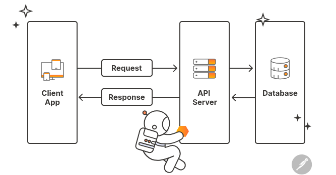
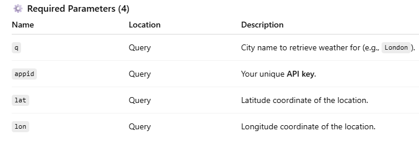
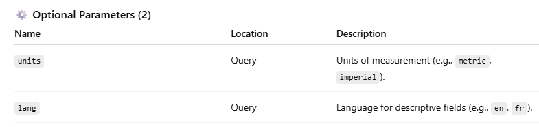
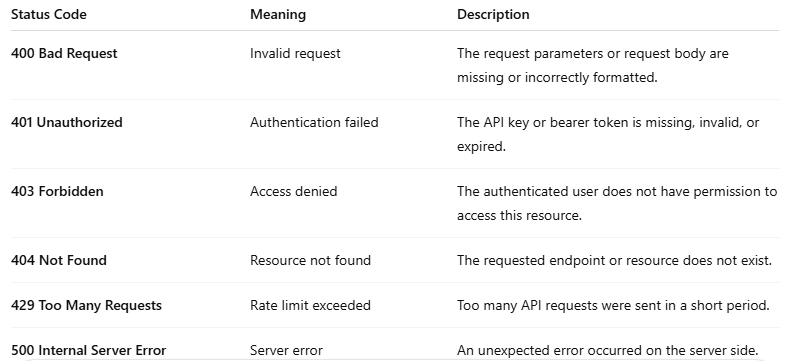

# API documentation for beginners

In this article, I am explaining what an API is, its types, methods, and URLs, and how to write API documentation from scratch. This article is intended for technical writers who are new to API documentation and want to build a solid understanding of the basics. By the end of this article, you will have a clear idea of what goes into writing effective API documentation.

## What is an API?

An API (Application Programming Interface) is a set of rules that allows one software application to talk to another software application and exchange data automatically.

In simple words, an API acts as a bridge or messenger between two systems. One system sends a request, and the other system returns a response — usually in a structured format like JSON.



### Example

When a user searches for flights on MakeMyTrip, the app does not store flight data itself. Instead, it sends API requests to multiple airline systems like Indigo, Air India, and Vistara. Each airline processes the request and returns flight details such as price, timing, and availability. MakeMyTrip collects these API responses and converts them into a common format.The combined results are then shown to the user as a single list of available flights. This entire process happens in real time using APIs.

## Purpose of API documentation

API documentation explains how developers can use an API correctly and efficiently. It provides details about endpoints, request parameters, authentication, and responses. Good documentation helps developers integrate APIs faster without constant support from backend teams. It reduces errors, misunderstandings, and development time.

## Intended audience

API documentation is primarily written for developers who integrate APIs into applications. It is also used by testers to validate API behavior and by technical writers to maintain accuracy. Internal APIs serve company teams, while external APIs help partners and third-party developers. Understanding the audience helps shape the clarity, depth, and examples in the documentation.

## Types of APIs

### REST APIs

A REST API is a lightweight and widely used API style based on HTTP. It uses methods like GET, POST, PUT, and DELETE to perform operations. REST APIs commonly use JSON format for data exchange.They are easy to build, scalable, and ideal for web and mobile applications.

### SOAP APIs

A SOAP API is a protocol-based API that follows strict standards. It uses XML format for all requests and responses. SOAP APIs include built-in security, error handling, and transaction support. They are commonly used in enterprise and legacy systems where reliability is critical.

## Types of REST APIs

1. **Internal (Private) REST APIs**: Internal REST APIs are used within an organization and are not exposed to external users. They help different internal systems or teams communicate with each other, such as frontend and backend services. These APIs usually have strict access controls and are documented mainly for internal developers. Example: A company’s HR system calling an internal payroll API.
   
1. **Public (Open) REST APIs**: Public REST APIs are exposed to external developers and third-party applications. They allow anyone (with proper authentication) to access certain features or data. Public APIs require clear, detailed documentation because the audience is broad and external. Example: Google Maps API or Facebook API used by external applications.
   
1. **Partner REST APIs**: Partner REST APIs are shared with specific business partners, not the general public. Access is restricted and typically granted through API keys or tokens. These APIs support integrations like payment gateways, logistics partners, or travel platforms. Example: Airline APIs shared with platforms like MakeMyTrip.

## How do you decide which types of APIs to document as a Technical writer

As a technical writer, you usually don’t decide the API type yourself — but you identify it correctly based on how the API is designed and implemented. Here’s how you can do that in a software company:

**Check the API endpoint and HTTP methods**

- REST APIs use standard HTTP methods like GET, POST, PUT, DELETE.
- SOAP APIs usually expose a single endpoint and use POST for all operations.

If you see multiple endpoints with different HTTP methods, it’s almost always REST.

**Look at the Request and Response format**

- REST APIs typically use JSON.
- SOAP APIs always use XML with a fixed envelope structure (<Envelope>, <Header>, <Body>). 

If the payload contains a SOAP envelope, it’s a SOAP API.

**Check for WSDL or OpenAPI files**

- SOAP APIs come with a WSDL (Web Services Description Language) file.
- REST APIs usually have an OpenAPI/Swagger specification or Postman collection.

If the team shares a WSDL, you’re documenting a SOAP API.

**Review authentication and sstandards**

- SOAP APIs often use WS-Security, digital signatures, and strict schemas.
- REST APIs typically use Bearer tokens, API keys, or OAuth.

The security model gives a strong hint about the API type.

## Common API terminologies

1. **Endpoint**: A specific URL where an API can be accessed to perform an operation. **Example**: /flights/search
1. **Base URL**: The main server address where the API is hosted. **Example**: https://api.example.com
1. **API version**: Indicates the version of the API to avoid breaking existing integrations. **Example**: /v1, /v2
1. **URL (Uniform Resource Locator)**: The complete address used to access an API endpoint. **Example**: https://api.example.com/v1/flights/search
1. **HTTP methods**: Define the action performed on an API resource. 
1. **GET** – Fetches data from the server
1. **POST** – Creates a new resource
1. **PUT** – Updates an existing resource completely
1. **PATCH** – Updates part of an existing resource
1. **DELETE** – Deletes a resource
1. **Request**: The information sent by the client to the API, including method, headers, parameters, and body.
1. **Response**: The data returned by the API after processing a request, usually in JSON format.
1. **Headers**: Key-value pairs that send metadata such as authentication tokens or content type. **Example**: Authorization: Bearer <token>
1. **Parameters**: Request Body – Data sent in POST or PUT requests.
1. **Payload**: The actual data sent in the request body or received in the response body.
1. **Authentication**: Verifies who is calling the API (API key, Bearer token, OAuth).
1. **JSON (JavaScript Object Notation)**: A lightweight and widely used data format for REST API communication.
1. **Status codes**: 200 – Success, 201 – Resource created, 400 – Bad request, 401 – Unauthorized, 403 – Forbidden, 404 – Not found, 500 – Server error.
1. **Curl**: A command-line tool used to send API requests and test APIs without a user interface. Developers often use curl to quickly verify API behavior. **Example**:

    ```bash
    curl -X GET https://api.example.com/v1/users
    ```
1. **Postman collection**: A group of related API requests organized together in Postman.

1. **Postman environment**: A set of variables (like base URL or tokens) used to switch between environments such as dev, test, and prod.

1. **Postman variables (key–value pairs)**: Reusable values stored in Postman, such as:
- base_url
- auth_token

## Tools for API documentation

- **Postman** is widely used to test APIs and create documentation directly from API requests and responses. It allows technical writers to add descriptions, parameters, authentication details, and examples.
- **Swagger (OpenAPI)** is used to define APIs using a standard specification that both humans and machines can understand. Swagger helps generate interactive API documentation and client/server code automatically.

## Core components of API documentation

- **API overview**: A brief description of what the API does and its business purpose.
- **Base URL and versioning**: Specifies the server address and API version to use.
- **Authentication**: Explains how clients authenticate (API key, Bearer token, OAuth).
- **Endpoints**: Lists available API paths and their functionality.
- **HTTP methods**: Defines actions like GET, POST, PUT, and DELETE for each endpoint.
- **Request parameters** – Describes required and optional inputs for the API.
- **Request body** – Shows the data structure sent in POST or PUT requests.
- **Response structure** – Explains the format and fields returned by the API.
- **Status codes** – Documents success and error codes returned by the API.
- **Error handling** – Describes common error scenarios and messages.
- **Example** – Provides sample requests and responses for better understanding.

## How to write API documentation 

For this example, we’ll use the **OpenWeatherMap Current Weather API**, a widely used public API that returns weather data for a given location. You can try this in Postman by signing up and getting your API key from **OpenWeatherMap**. Resource: [OpenWeatherMap API key docs](https://docs.openweather.co.uk/appid?)

### API definition

This API provides the current weather data for any city in the world. Consumers send the city name and API key, and in response, the API returns structured weather information like temperature, humidity, and conditions in JSON format.
Resource: [Open Weather Map API docs](https://publicapi.dev/open-weather-map-api?)

### Base URL

Base URL: (https://api.openweathermap.org/data/2.5/weather)

This URL points to the current weather endpoint of the service, to which query parameters will be appended.

### Method

**GET**: This method requests information from the API without modifying any server data. It is the most common method for read-only operations. 

### Authentication

This API uses an API key for authentication. You must obtain your key from the OpenWeatherMap dashboard and include it in every request.

### Request parameters

[](images/requiredparameters.png)

[](images/optional.png)

### Response parameters

Here’s a simplified breakdown of a typical JSON response:

**Status code: 200**

**Data returned successfully**.

```json
{
  "weather": [
    { "main": "Clear", "description": "clear sky" }
  ],
  "main": {
    "temp": 289.5,
    "humidity": 71
  },
  "wind": {
    "speed": 4.1
  },
  "name": "London"
}

```

- **weather** – Array with weather condition objects
- **main.temp** – Temperature
- **main.humidity** – Humidity percentage
- **wind.speed** – Wind speed
- **name** – City name returned by API

### Error codes



## Conclusion

If you are new to API documentation, this article helps you build clarity step by step. You now understand what an API is, why documentation is important, and who relies on it. You have learned the essential structure of API documentation, including requests, responses, and error handling. This knowledge enables you to read existing API documents with confidence and start writing your own. With consistent practice, you can apply these fundamentals to real-world APIs. Mastering these basics is your first step toward writing clear and reliable API documentation.

For any queries, contact me - **pankajsharmawriter@gmail.com**.
## Reference

-  [About me](./)


