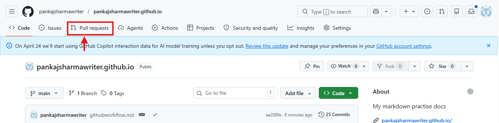

# End-to-end GitHub workflow for Technical Writers

In this article, I am explaining the end-to-end documentation contribution workflow that I followed as a Technical Writer at Microsoft. This workflow covers every step, from receiving a task assignment via email to getting your changes reviewed and merged into the main branch on GitHub. I walk you through cloning a repository, working on a feature branch, editing documentation files in VS Code, committing and pushing your changes, and finally creating a Pull Request (PR) for your manager to review and approve. Whether you are a new technical writer joining a docs-as-code team or an experienced writer looking to standardize your process, this article gives you a clear, repeatable workflow grounded in real-world practice. The tools covered include Git, GitHub, GitHub Desktop, and Visual Studio Code (VS Code), all of which are industry-standard in modern documentation environments.

## Step 1: receiving the task assignment via email

Every documentation task at Microsoft began with an email from my manager. This email was not just a notification — it was the official task handoff. The email typically contained:
- A brief description of the documentation work to be done (new article, update, review, etc.)
- The link to the specific branch on GitHub that I needed to work on
- Any additional context, style guidelines, or deadline information
- References to any related tickets or project trackers such as Azure DevOps
  
This email-based task assignment ensured that all work was traceable, communication was documented, and I always had the exact branch reference before touching any code or content. It also helped avoid confusion in multi-writer teams where several branches might be active simultaneously.

## Step 2: cloning the repository via GitHub

Once I had the branch link from my manager's email, the next step was to clone the repository to my local machine. Cloning creates a local copy of the remote repository so you can work on the files offline. GitHub makes this straightforward through its web interface without needing any command-line knowledge.

### Cloning via the GitHub web interface

To clone the repository using the GitHub website:

1. Open your browser and go to the repository. For reference, my portfolio repository is at: [https://github.com/pankajsharmawriter/pankajsharmawriter.github.io/](https://github.com/pankajsharmawriter/pankajsharmawriter.github.io/)
1. Click the **green Code button** near the top right of the repository page.
1. In the dropdown that appears, click **Open with GitHub Desktop**.
1. Your browser will prompt you to open GitHub Desktop. Click the **confirmation button** to proceed.
1. GitHub Desktop launches and displays a Clone a Repository dialog with the repository URL and the local path where the files will be saved on your machine.
1. Confirm or change the local path as needed, then click **Clone**.
1. GitHub Desktop downloads the repository to your machine and opens it automatically.

### Switching to the assigned branch in GitHub Desktop

After cloning, GitHub Desktop opens the repository on the default branch. Since my manager assigned a specific feature branch, I needed to switch to it before making any edits.
1. In GitHub Desktop, click the **Current Branch** dropdown at the top of the window.
1. A list of all available branches appears. Locate the branch name shared by your manager in the email.
1. Click the branch name to switch to it.
1. GitHub Desktop updates the working files to reflect the selected branch.

Once the correct branch is active, GitHub Desktop displays the current branch name prominently in the toolbar, confirming that any edits you make will be tracked against that branch and not the main branch.

## Step 3: editing articles in Visual Studio Code

With the branch open in GitHub Desktop, the next step was to edit the documentation files. At Microsoft, most documentation was written in Markdown (.md) and managed within a docs-as-code framework. VS Code was the standard editor for this purpose.

### Opening the repository in VS Code

From GitHub Desktop, opening VS Code is straightforward:
1. In GitHub Desktop, click **Repository** in the top menu.
1. Select **Open in Visual Studio Code**.
1. VS Code opens the entire repository as a workspace.

### Working on documentation files

In VS Code, I navigated the file tree on the left panel to locate the article I needed to edit. Documentation files were typically Markdown files organized in folders by product area or content type. During editing, I focused on several areas:
- **Accuracy**: verifying technical details against the product specifications or engineering notes provided.
- **Style compliance**: applying Microsoft Writing Style Guide conventions, including active voice, sentence-style capitalization, and second-person tone.
- **Formatting**: ensuring proper use of Markdown syntax for headings, code blocks, tables, numbered lists, and notes.
- **Consistency**: maintaining terminology consistency with related articles in the same product area.
- **Link validation**: checking that all internal cross-references and external links were active and correctly targeted.

VS Code's built-in Markdown preview (Ctrl+Shift+V) allowed me to see a rendered version of the document while editing, which made it easier to catch formatting errors before committing changes.

## Step 4: committing and pushing changes

After completing edits, the changes needed to be saved to the remote repository. This involves two key operations: committing and pushing.

### Commit changes in GitHub Desktop

A commit records a snapshot of your changes to the local repository. In GitHub Desktop:
1. Switch to GitHub Desktop. The Changes tab on the left panel shows all modified files.
1. Review each file. GitHub Desktop displays a diff view showing exactly what was added (green) or removed (red).
1. Check the box next to each file you want to include in the commit.
1. Write a clear commit message in the Summary field at the bottom. A good commit message describes what was changed and why, for example: "Updated Azure App Service quickstart — added note on free tier limits".
1. Optionally, add a longer description in the Description field for complex changes.
1. Click **Commit** to `<branch-name>`.

### Push changes to the remote repository

A commit only saves changes locally. To make them available on GitHub for review, you must push them to the remote branch. In GitHub Desktop, click the Push origin button in the top toolbar after committing. This uploads your committed changes to the corresponding branch on GitHub.

> Best practice: commit and push regularly rather than accumulating large batches of changes. Smaller, focused commits are easier for reviewers to evaluate and simpler to revert if an issue is found.

## Step 5: create a Pull Request (PR)

A Pull Request (PR) is a formal request to merge your branch's changes into the main branch. It is the checkpoint where your manager or peer reviewer evaluates your work before it goes live. Creating a PR is a multi-step process on GitHub.

### Step-by-step: create a PR on GitHub

1. Open your browser and navigate to your repository on GitHub: [https://github.com/pankajsharmawriter/pankajsharmawriter.github.io/](https://github.com/pankajsharmawriter/pankajsharmawriter.github.io/)
1. After pushing your changes, GitHub usually displays a banner at the top of the repository page: "<branch-name> had recent pushes" with a Compare & pull request button. Click it.
1. If the banner is not visible, click the Pull requests tab in the top navigation bar of the repository, then click the green **New pull request button**.
    
1. On the Compare changes page, verify the following: Base branch (left): This should be main — the branch you want to merge your changes into. Compare branch (right): This should be your feature branch — the branch containing your changes.
1. Review the file diffs shown below the branch selectors to confirm that only your intended changes are included.
1. Click **Create pull request**.
1. On the PR creation form, fill in the following fields: 
   - Title: a concise, descriptive title summarizing the change, for example, **Add prerequisites section to Azure CLI quickstart**. 
   - Description: provide context for the reviewer — what changed, why it changed, and any specific areas requiring attention. 
   - Reviewers: add your manager or designated reviewer using the Reviewers panel on the right. 
   - Labels: optionally, add labels such as "documentation" or "in review" to categorize the PR. Linked issues: If the work is tied to a task or bug in a project tracker, link it here.
1. Click **Create pull request** to submit the PR for review.
1. GitHub will notify the assigned reviewer by email. The PR is now visible under the Pull requests tab of the repository.

You can see a live example of the PR creation interface at: [https://github.com/pankajsharmawriter/pankajsharmawriter.github.io/pulls](https://github.com/pankajsharmawriter/pankajsharmawriter.github.io/pulls)

## Step 6: manager review and PR approval

Once the PR is created, the review process begins. At Microsoft, my manager was the designated reviewer and approver for all documentation PRs. This stage involved several activities:

### Review activities
- **Inline comments**: the reviewer adds comments directly on specific lines in the diff view. These could flag factual errors, style issues, unclear phrasing, or missing information.
- **Suggested changes**: gitHub allows reviewers to suggest specific edits inline. As the author, you can accept or reject these suggestions with a single click.
- **Requesting changes**: if significant revisions are needed, the reviewer selects "Request changes," which prevents the PR from being merged until the comments are addressed.
- **Approval**: when the content meets quality standards, the reviewer selects "Approve" on the PR.

As the author, I was responsible for monitoring the PR for reviewer comments, making any requested revisions in my local branch, and pushing updated commits to the same branch. GitHub automatically updates the PR with any new commits pushed to the feature branch, so there is no need to create a new PR after making revisions.

## Step 7: merging to main and handling conflicts

Once the PR was approved, my manager handled the final merge. This was a deliberate team policy — only the manager merged to main — to ensure that the main branch always contained reviewed, approved content.

### The merge process
The manager performed the merge using the following steps:
1. Open the PR on GitHub.
1. Verify the PR is marked as Approved and all required checks (CI pipelines, linting) have passed.
1. Click the **Merge pull request button**.
1. Select the **merge strategy** (typically "Merge commit" or "Squash and merge" depending on team conventions).
1. Click **Confirm merge**.
1. Optionally, delete the feature branch after merging to keep the repository clean.

### Handling merge conflicts

Merge conflicts occur when two branches have made changes to the same lines in the same file, and Git cannot automatically determine which version to keep. This was handled exclusively by my manager at Microsoft, but it is valuable for technical writers to understand what happens during conflict resolution.

When a conflict exists, GitHub marks the PR with a **This branch has conflicts that must be resolved** message. My manager resolved conflicts directly through the GitHub web interface using the following steps:
- On the PR page, click the **Resolve conflicts button** that GitHub displays when conflicts are detected.
- GitHub opens its built-in web editor showing the conflicting file. Conflict sections are highlighted clearly — the content from the current branch appears above a dividing line, and the incoming content appears below it.
- The manager reviewed both versions and manually edited the file to retain the correct content, removing the conflict markers that GitHub inserted.
- After resolving all conflicts in the file, the manager clicked **Mark as resolved**.
- If multiple files had conflicts, the process was repeated for each one.
- Once all conflicts were resolved, the manager clicked Commit merge to finalize the resolution and complete the merge into main.

While conflict resolution was my manager's responsibility in this workflow, understanding the process helps technical writers write cleaner commit messages, communicate proactively about overlapping edits, and avoid contributing to conflicts in the first place by keeping feature branches short-lived and scoped to a single task.

## Step 8: post-merge notification and output verification

At Microsoft, the documentation workflow did not end at the merge. Once my manager merged the PR into the main branch, an automated publishing pipeline ran in the background. This system detected the merge, built the updated documentation, and deployed it live to Microsoft Learn — Microsoft's official documentation portal. Within a short time after the merge, I received an email notification confirming that the content was live, along with the direct URL to the published article on Microsoft Learn.
For example, one of the articles I worked on is published at: [https://learn.microsoft.com/en-us/power-platform/guidance/case-studies/abn-amro-enhances-ai](https://learn.microsoft.com/en-us/power-platform/guidance/case-studies/abn-amro-enhances-ai). This is what the email-to-merge workflow ultimately produces — a live, publicly accessible documentation page on Microsoft Learn.

### Why the live URL matters more than the VS code preview

During the editing phase, VS Code offers a built-in Markdown preview that renders the content as you write. While this is useful for catching obvious formatting issues, it does not accurately represent how the content will look on the actual Microsoft Learn portal. The VS Code preview renders standard Markdown, but Microsoft Learn applies its own custom styles, layout templates, component rendering rules, and navigation structures on top of the content. Several scenarios where the VS Code preview falls short include:

- Custom admonition blocks such as Note, Tip, Warning, and Important render as styled callout boxes on Microsoft Learn, but appear as plain blockquotes or text in VS Code preview.
- Tab groups and interactive content components, which are supported on Microsoft Learn, do not render correctly in a local Markdown preview.
- Table formatting, especially wide tables with many columns, may appear differently due to the portal's responsive CSS versus VS Code's preview stylesheet.
- Images and media elements may display at different sizes or aspect ratios depending on the portal's layout versus the local preview window.
- Cross-references and internal links resolve against the live content tree on Microsoft Learn, which may produce different anchor behaviour than what the local preview shows.

### Verify the published output

Once I received the live URL in the post-merge email notification, I opened it in the browser and reviewed the published article thoroughly. This verification step was as important as the writing itself. I checked the following:

- **Visual formatting**: headings, paragraph spacing, bullet lists, numbered lists, and tables were rendering correctly according to the Microsoft Learn stylesheet.
- **Callout blocks**: Note, Warning, Tip, and Important blocks were displaying with the correct icons and background colors.
- **Code samples**: any inline code or code blocks were rendering in the correct monospace font with proper syntax highlighting where applicable.
- **Images**: all images were loading, correctly sized, and accompanied by accurate alt text.
- **Links**: all hyperlinks — both internal cross-references and external links — were active and pointing to the correct destinations.
- **Navigation**: the article appeared correctly in the left-side navigation panel of the Microsoft Learn documentation tree.
- **Metadata**: the article title, description, and breadcrumb path were displaying accurately 

### Fixing issues found after publishing

If the live output revealed any issues — a misaligned table, a broken callout block, an image not rendering at the expected size, or any other discrepancy — I did not treat the work as complete. Instead, I returned to my local repository in VS Code, made the necessary corrections to the Markdown file, and repeated the entire workflow: commit the fix, push to the branch, create a new PR, get approval, and wait for the automated pipeline to republish the updated content.

> This iterative approach — write, publish, verify, fix, repeat — is what separates a thorough documentation professional from one who considers the job done at the point of merge. The published URL is the final deliverable, and it must meet the same quality standard as the source Markdown file.

## Tools used in this workflow
Here is a quick reference to the tools used at each stage of this workflow:

- GitHub: cloud-based hosting for Git repositories. Manages the remote repository, PR workflow, and code review.
- GitHub Desktop: a GUI client for Git. Simplifies branch switching, committing, pushing, and repository management without requiring deep command-line expertise.
- Visual Studio Code (VS Code): a lightweight, extensible code editor. Used for editing Markdown files, with built-in terminal, diff view, and Markdown preview.
- Email: task handoff medium. The entry point for every documentation task via the manager-assigned branch link.

## Conclusion

The GitHub-based documentation workflow described in this article represents the practical, day-to-day reality of working as a technical writer in a modern, docs-as-code environment. From receiving a task via email to seeing your changes merged into the main branch, every step in this workflow has a clear purpose and a defined owner.

For technical writers who are new to version control, this workflow can feel unfamiliar at first. The branching model and the PR review process are all concepts that documentation professionals traditionally did not need to know. However, as documentation increasingly lives alongside code in the same repositories, these skills have become as essential as writing itself.

For experienced technical writers already familiar with GitHub, this article offers a clear framework for onboarding new team members, standardizing contribution workflows across documentation teams, and communicating your process to non-writing stakeholders like engineering managers or DevOps teams.

The workflow covered here — email handoff, branch cloning, editing in VS Code, committing and pushing, PR creation, review, approval, and merge — is not specific to Microsoft. It is a universal pattern that you will encounter across technology companies, open-source projects, and any organization that treats documentation as code. Mastering it does not just make you a better technical writer; it makes you a more credible and collaborative contributor in any software development team.
You can explore my documentation portfolio at [https://pankajsharmawriter.github.io/](https://pankajsharmawriter.github.io/) to see real-world examples of the documentation artifacts produced through this kind of workflow.

For any query, contact me at **pankajsharmawriter@gmail.com**.

## Reference

-  [About me](./)

