# Markdown documentation using VS code and Github (Doc As Code)

In this article, you will learn how to write Markdown documentation using Visual Studio Code (VS Code) and GitHub. The article walks you through the complete setup process, starting with configuring Markdown support in VS Code and setting up GitHub Desktop for version control.

You will also learn how to create and manage Markdown files, commit your changes using GitHub Desktop, and publish your documentation to the GitHub website. Each step is explained in a simple and practical manner, making it easy for beginners to follow along.

By the end of this article, even if you are new to Markdown, you will have a strong understanding of how to create, manage, and publish Markdown documentation using VS Code and GitHub.

## What is Markdown?

Markdown is a lightweight markup language used to format plain text using simple symbols. It allows you to write structured content—such as headings, lists, links, tables, and code—without using complex tools or HTML.

You write Markdown in a normal text editor like VS Code, save it as a .md file, and tools like GitHub automatically convert it into well-formatted HTML.

## What is VS Code?

Visual Studio Code (VS Code) is a free, lightweight code editor used to write, edit, and manage Markdown documentation efficiently. For technical writers, VS Code acts as a powerful writing environment where Markdown files (.md) can be created, previewed, validated, and version-controlled before publishing to platforms like GitHub.

Unlike traditional word processors, VS Code treats documentation as structured text, making it ideal for modern documentation workflows.

## What is Github Desktop?

GitHub Desktop is a free graphical application that helps writers manage, track, and publish Markdown documentation to GitHub without using command-line Git commands. For Markdown documentation, it acts as a bridge between VS Code (where you write) and GitHub (where you publish and collaborate).

It allows technical writers to focus on content while GitHub Desktop handles version control visually.

## How to setup VS code on Windows 11 ?

You can download Microsoft VS code from [here](https://code.visualstudio.com/download).

Once the download is complete, you can install the VSCodeUserSetup-x64-1.108.2.exe setup file.


## How to Sign Up a GitHub Account

You can sign up for github account to see all your published markdown files.

1. Go to [Github.com](https://github.com) in your browser.
1. Click **Sign up**.
1. Enter **email address**, **password**, and **username**.
1. To verify your email, Github will send a verification code to your email. Enter the code on Github.
1. Choose your account preferences. For example: experience level.
1. Select **Free plan**.

This way you sign up for Github free account.

## How to setup Github on Windows 11 ?

You can download Microsoft Github desktop from [here](https://desktop.github.com/download/).

Once the download is complete, you can install the GitHubDesktopSetup-x64.exe setup file.

## How to setup Markdown in VS Code

You can setup Markdown in VS code in following ways:

1. To open the VS code, double click on the VS code icon.
1. Click **Extensions**, and search for Markdown.
1. Select **Markdown All in One extension**, and click **Install**.

[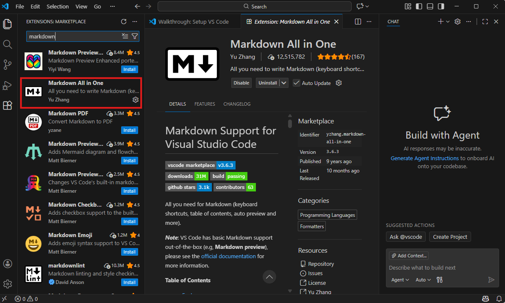](images/Markdownextension.png)

You have successfully installed Markdown in VS code.

## Setup Github Repository

Now you have to create a repository which you can access in Github desktop as well as in VS code.

1. On your Windows 11, select a drive. For example: D drive.
1. Create a folder **GithubRepository->markdown-docs**. 

You go back to VS Code and open this repository folder.

1. Click **File** -> **Open folder**.
1. Browse for **markdown-docs** in your local drive and select Select folder. Now VS code is connected to markdown-docs folder.
1. Select **markdown-docs**, click **New file**.
1. Rename the file as **index.md** and press **enter**.
1. Repeat step 3-4 to add all the .md files in VS code.

This way you create markdown files in VS code.

## Add content in index.md

1. In VS Code, select **index.md**.
1. Add the following metadata.

    ```yaml
    ---
    title: About me
    layout: default
    ---
    ```
1. Now add headings and content.
1. Add **My Documentation Pages** heading at the bottom with links to other articles.

```markdown
## My Documentation Pages

- [Documentation development life cycle](./ddlc)
- [Microsoft style guide cheatsheet](./msstyle)
- [API documentation for beginners](./api)
- [How to create Multilevel List Headings in MS Word](./multilevellist)
```

Now from the index page, you can access all the articles.


## Create a GitHub Repository Using GitHub Desktop

1. To open Github Desktop, double click on **Github Desktop icon**.
1. Click **File** -> **Add local repository**.
1. Select **Choose** -> select **markdown-docs** folder.
1. Click **Add Repository**.

Now Github desktop will display a notification:
> "This directory doesn't appear to be a Git repository". 

Dont' worry. Click **OK**.

1. Click **Create a Repository**.

   Now fill details:

   - **Name**: markdown-docs
   - **Description**: My markdown practice repository
   - Keep **path** as it is

2. In the final step, click **Create Repository**.

This way you have now added **markdown-docs** repository in your Github Desktop.

## Commit Markdown files

In the Github Desktop, you will see a list of markdown files in the left pane. 
To commit your markdown files:


[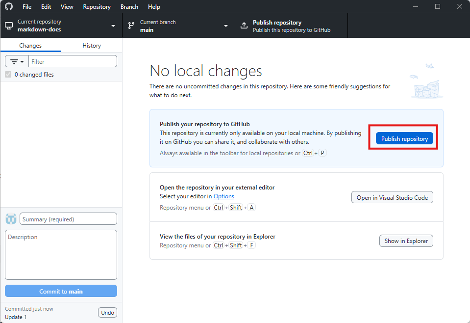](images/github_publish.png)

This way you publish your markdown-docs repository on Github.

## Open published Github files on Github Pages

1. Open your browser.
1. Go to your repository on [GitHub.com](https://github.com).
1. Click **Settings** -> **General**, scroll down to **Danger Zone**.
1. Click **Change visibility**, select **change to public**.
1. Click **Pages**.
1. In **Source**, select **Deploy from a branch**.
1. In **Branch**, select **main** and **/root**.
1. To save changes, click **Save**.
1. Refresh the page.

Now you will see your published site url at the top. Open the URL and bookmark it as your Github Page site. See the following image:

[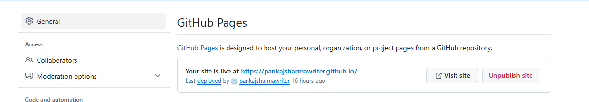](images/PublishedSite.png)

## How to write Markdown documentation in VS code

You usually start Markdown documentation with metadata to give readers and tools clear context about the document. Below are the commonly used metadata types you should include at the top of a Markdown file:

- **Title**: Defines the name of the document.

- **Author**: Mentions who created or owns the document.

- **Description**: A short explanation of what the document covers.

- **Version**: Indicates the current version of the document.

- **Layout**: Specifies the template or theme used to render the document on the web.

[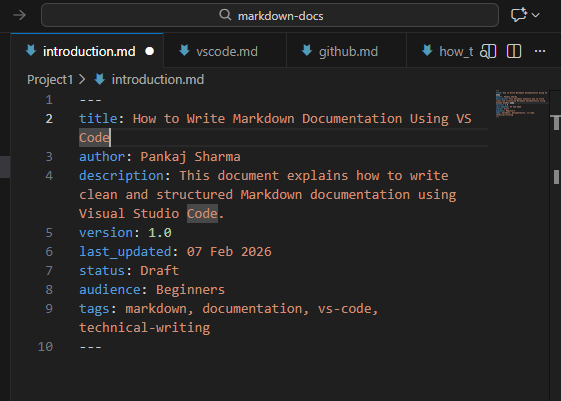](images/Markdown_Metadata.png)

### Headings

To create a heading, add number signs (#) in front of a word or phrase. The number of number signs you use should correspond to the heading level. For example, to create a heading level three (<h3>), use three number signs (For example, ### My Header).

[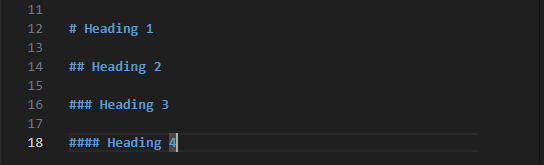](images/Headings.png)

### Paragraphs

To create paragraphs, use a blank line to separate one or more lines of text.

[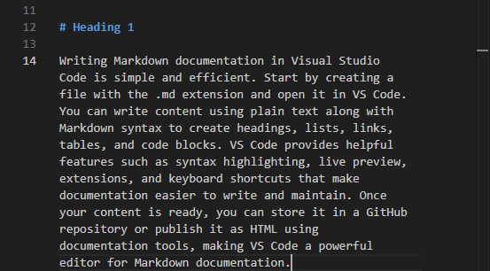](images/paragraph.png)

### Bold

To bold a text, add two asterisks before and after a word or phrase.

[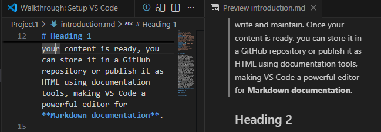](images/Bold.png)

### Italic

To italicize a text, add one asterisk before and after a word or phrase.

[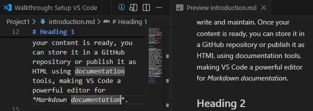](images/italic.png)

### Bold and italic

To emphasize text with bold and italics at the same time, add three asterisks before and after a word or phrase.

[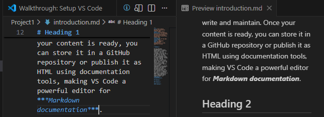](images/Bold_Italic.png)

### Blockquotes

To create a blockquote, add a > in front of a paragraph.

[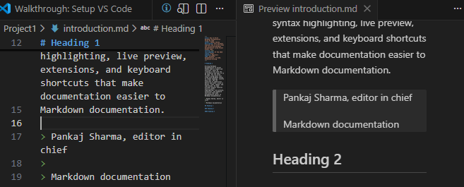](images/Bloquotes.png)

### Ordered list

To create an ordered list, add line items with numbers followed by periods. The numbers don’t have to be in numerical order, but the list should start with the number one.

[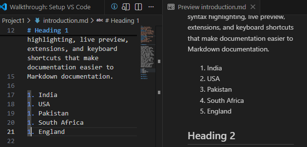](images/OrderedList.png)

### Unordered list

To create an unordered list, add dashes (-) in front of line items.

[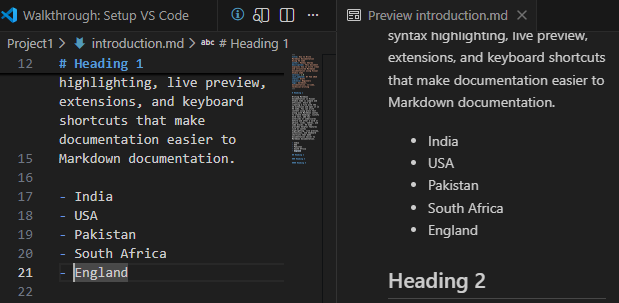](images/UnorderedList.png)

### Code block

To represent a code block, use three backticks (```) to open and close the code block.

[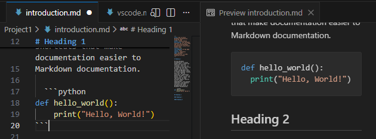](images/CodeBlock.png)

### Links

To create a link, enclose the link text in brackets (e.g., [Duck Duck Go]) and then follow it immediately with the URL in parentheses (for example, (https://duckduckgo.com)).

[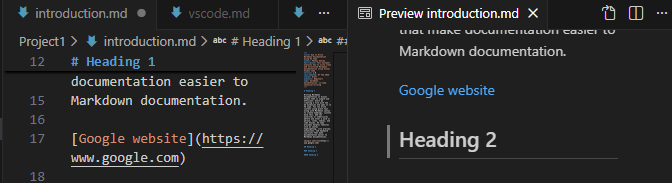](images/Links.png)

### Images

To add an image, add an exclamation mark (!), followed by alt text in brackets, and the path or URL to the image asset in parentheses. You can optionally add a title in quotation marks after the path or URL.

[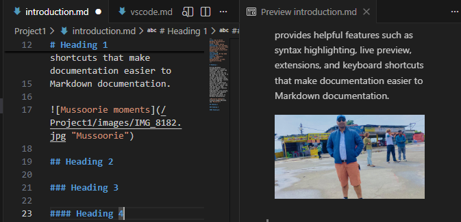](images/Images.png)

### Tables

Use the following syntax to create a table in Markdown.

[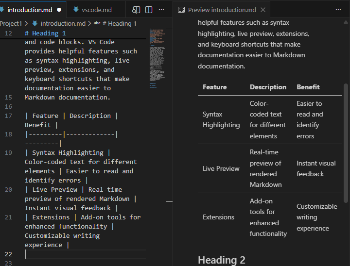](images/Table.png)

### Note

In the latest version of VS code, you can use Microsoft copilot agent to check your content or to know different syntaxes for your markdown documentation. You must login to github in VS code to use Microsoft copilot.

## Conclusion

This detailed article helps technical writers clearly understand how Markdown, VS Code, and GitHub Desktop work together in a Docs-as-Code environment. By following the step-by-step explanations, writers can confidently create, format, version, and publish documentation. The article simplifies technical concepts, making Markdown easy to learn even for beginners. It also shows how VS Code improves writing productivity and how GitHub Desktop enables smooth collaboration and version control. Overall, this approach empowers technical writers to build scalable, maintainable, and modern documentation workflows.

For any query, contact me at **pankajsharmawriter@gmail.com**.

## Reference

-  [About me](./)