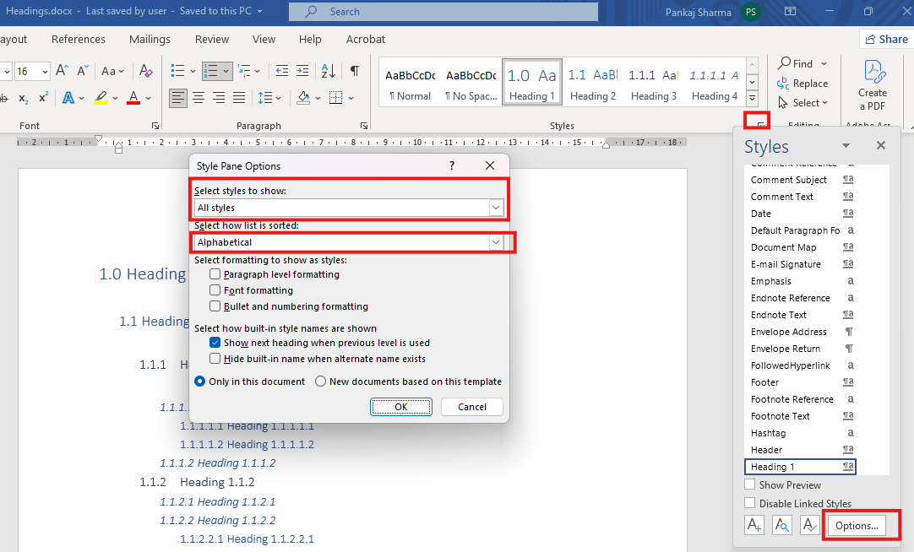
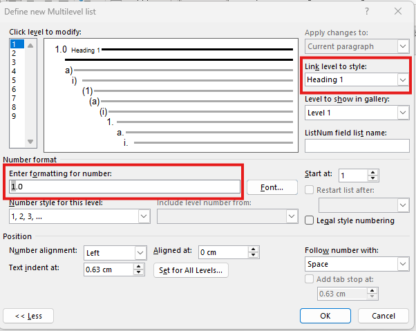
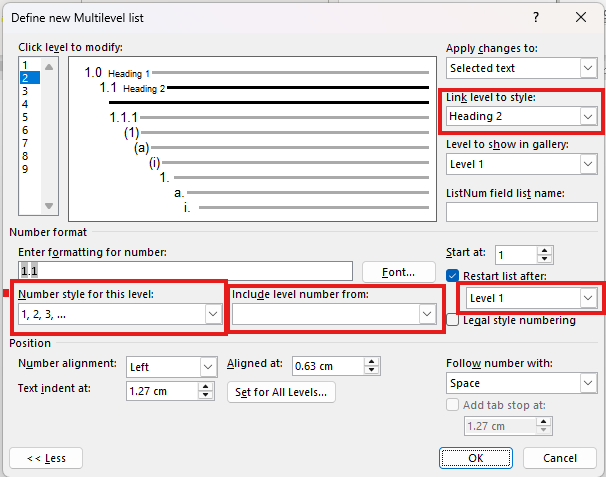
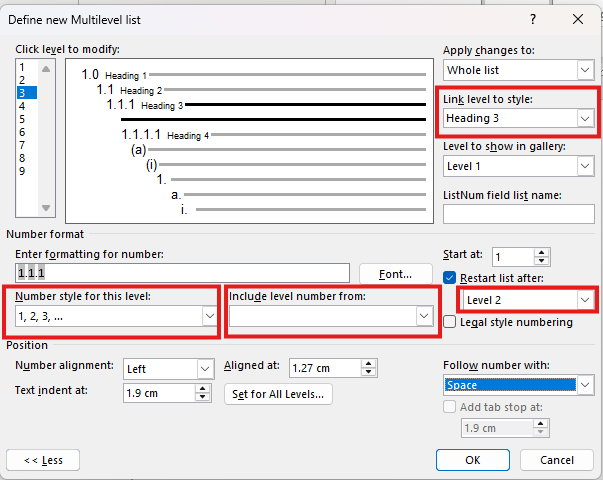
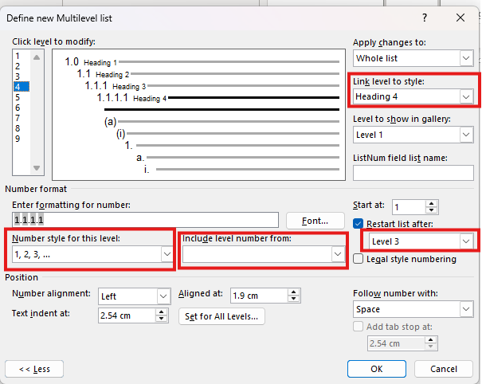
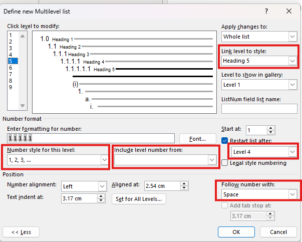

# How to create Multilevel List Headings in MS Word

A multilevel list heading in MS Word is a structured heading system that automatically numbers headings across multiple hierarchical levels to show document structure clearly.

To create a multilevel list in MS Word, you must work with two things together: Heading styles and the Multilevel List feature. Using only one of them will not give correct or stable numbering.

## Check Headings 

1. Open new blank document in MS word.
1. Go to style pane and check if all Headings (Heading 1- Heading 5) are visible. If yes, skip the further steps, If not, follow further steps.
1. Click on arrow in the style pane to open the styles.
1. Click **Options**.
1. In **Select styles to show**, select **All styles**.
1. In **Select how list is sorted**, select **Alphabetical**.
1. Click **OK**.

By default every MS Word file contains Heading 1 - Heading 5 in style pane but in some cases it shows only Heading 1 and Heading 2. 

## Create Multilevel Heading List 1

1. Write Heading 1.0 in your word document and select it.
1. Click **Multilevel List** dropdown menu.
1. Select **Define New Multilevel List**.
1. Select **Level 1**.
1. In **Link level to style**, select **Heading 1**.
1. In **Enter formatting for number**, delete everything.
1. In **Number style for this level**, select **1,2,3**. This will add 1 in step 6.
1. In **Enter formatting for number**, add .0 after 1. So that it should display **1.0**.
1. In **Follow number with**, select **Space**. 
1. To apply changes, click **OK**.

Now you have successfully created Multilevel Heading List 1.

When you apply Heading 1 from style pane, it should look like:

1.0 Heading

2.0 heading

3.0 heading

4.0 Heading

5.0 Heading

## Create Multilevel Heading List 2

1. Select **1.0 Heading** in your word document.
1. Click **Multilevel List** dropdown menu.
1. Select **Define New Multilevel List**.
1. Select **Level 2**.
1. In **Link level to style**, select **Heading 2**.
1. In **Enter formatting for number**, delete everything.
1. In **Include level number from**, select **Level 1**. This will add 1 in step 6.
1. In **Number style for this level**, select **1,2,3**. This will further add 1 in step 6.
1. In **Enter formatting for number**, add dot (.) between two 1s. It should display **1.1**.
1. In **Restart list after**, select **Level 1**.
1. In **Follow number with**, select **Space**.
1. To apply changes, click **OK**.

You have now successfully created Multilevel Heading List 2.

When you apply Heading 2 from style pane, it should look like:

1.1 Heading

1.2 Heading

2.1 Heading

2.2 Heading

3.1 Heading

3.2 Heading and so on.

## Create Multilevel Heading List 3

1. Select **1.0 Heading** in your word document.
1. Click **Multilevel List** dropdown menu.
1. Select **Define New Multilevel List**.
1. Select **Level 3**.
1. In **Link level to style**, select **Heading 3**.
1. In **Enter formatting for number**, delete everything.
1. In **Include level number from**, select **Level 1**. This will add 1 in step 6.
1. In **Include level number from**, select **Level 2**. This will further add 1 in step 6.
1. In **Number style for this level**, select **1,2,3**. This will further add 1 in step 6.
1. In **Enter formatting for number**, add dot (.) between every two 1s. It should display **1.1.1**.
1. In **Restart list after**, select **Level 2**.
1. In **Follow number with**, select **Space**.
1. To apply changes, click **OK**.

You have now successfully created Multilevel Heading List 3.

When you apply Heading 3 from style pane, it should look like:

1.1.1 Heading

1.1.2 Heading

2.1.1 Heading

2.1.2 Heading

3.1.1 Heading

3.1.2 Heading and so on.

## Create Multilevel Heading List 4

1. Select **1.0 Heading** in your word document.
1. Click **Multilevel List** dropdown menu.
1. Select **Define New Multilevel List**.
1. Select **Level 4**.
1. In **Link level to style**, select **Heading 4**.
1. In **Enter formatting for number**, delete everything.
1. In **Include level number from**, select **Level 1**. This will add 1 in step 6.
1. In **Include level number from**, select **Level 2**. This will further add 1 in step 6.
1. In **Include level number from**, select **Level 3**. This will further add 1 in step 6.
1. In **Number style for this level**, select **1,2,3**. This will further add 1 in step 6.
1. In **Enter formatting for number**, add dot (.) between every two 1s. It should display **1.1.1.1**.
1. In **Restart list after**, select **Level 3**.
1. In **Follow number with**, select **Space**.
1. To apply changes, click **OK**.

You have now successfully created Multilevel Heading List 4.

When you apply Heading 4 from style pane, it should look like:

1.1.1.1 Heading

1.1.1.2 Heading

2.1.1.1 Heading

2.1.1.2 Heading

3.1.1.1 Heading

3.1.1.2 Heading and so on.

## Create Multilevel Heading List 5

1. Select **1.0 Heading** in your word document.
1. Click **Multilevel List** dropdown menu.
1. Select **Define New Multilevel List**.
1. Select **Level 5**.
1. In **Link level to style**, select **Heading 5**.
1. In **Enter formatting for number**, delete everything.
1. In **Include level number from**, select **Level 1**. This will add 1 in step 6.
1. In **Include level number from**, select **Level 2**. This will further add 1 in step 6.
1. In **Include level number from**, select **Level 3**. This will further add 1 in step 6.
1. In **Include level number from**, select **Level 4**. This will further add 1 in step 6.
1. In **Number style for this level**, select **1,2,3**. This will further add 1 in step 6.
1. In **Enter formatting for number**, add dot (.) between every two 1s. It should display **1.1.1.1.1**.
1. In **Restart list after**, select **Level 4**.
1. In **Follow number with**, select **Space**.
1. To apply changes, click **OK**.

You have now successfully created Multilevel Heading List 5.

When you apply Heading 5 from style pane, it should look like:

1.1.1.1.1 Heading

1.1.1.1.2 Heading

2.1.1.1.1 Heading

2.1.1.1.2 Heading

3.1.1.1.1 Heading

3.1.1.1.2 Heading and so on.

This way you have successfully created Multilevel Heading List from Heading 1 to Heading 5 in MS Word document. You can now save this file by applying CTRL+S. 

## Conclusion

Creating a multilevel heading list in MS Word is often considered one of the most challenging tasks for technical writers, mainly because it requires a clear understanding of both heading styles and numbering logic. By following a structured, step-by-step approach from Heading 1 to Heading 5, you can avoid common numbering issues and achieve consistent results. This process helps maintain a clean document hierarchy and reduces the risk of manual errors. Once set up correctly, headings automatically renumber as content changes, saving significant time during revisions. Mastering multilevel headings also enables seamless navigation and accurate Table of Contents generation. Overall, this approach empowers technical writers to create professional, scalable, and well-structured Word documents with confidence.

For any query, contact me at **pankajsharmawriter@gmail.com**.

## Reference

-  [About me](./)